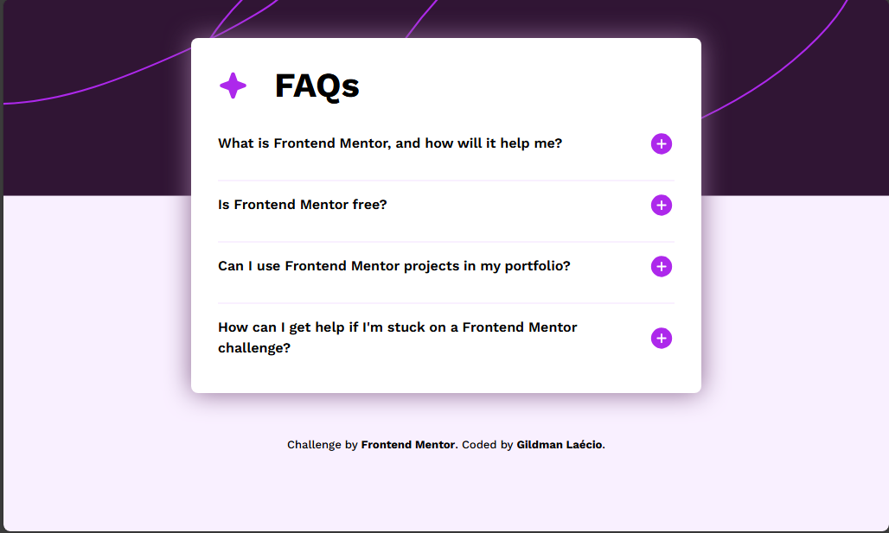
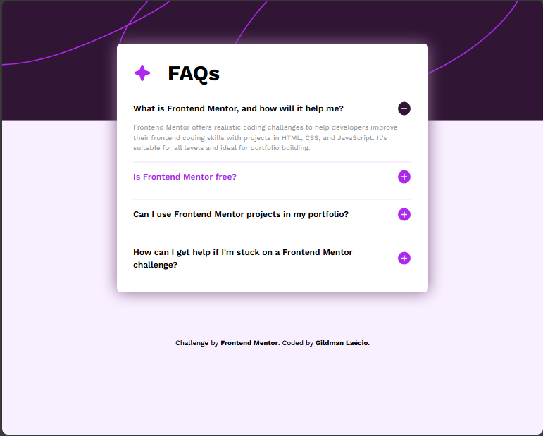
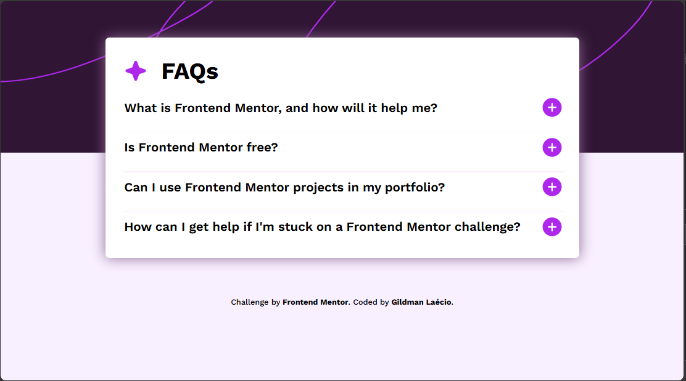
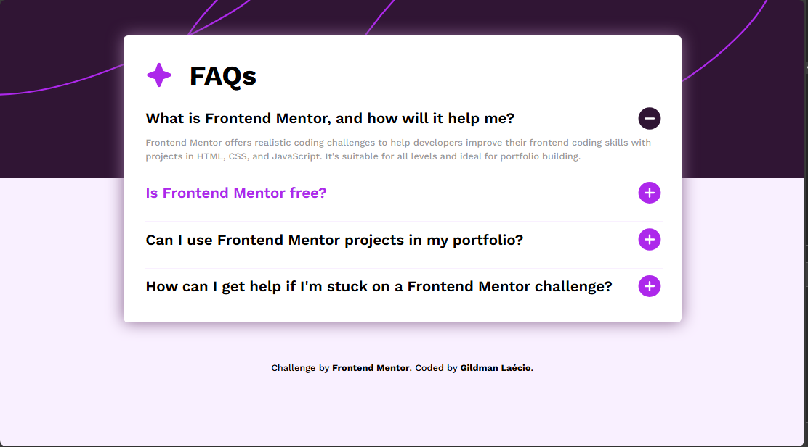
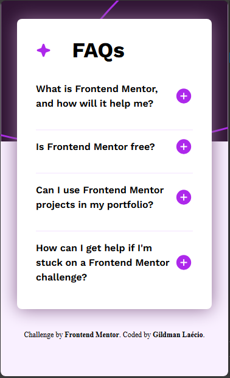
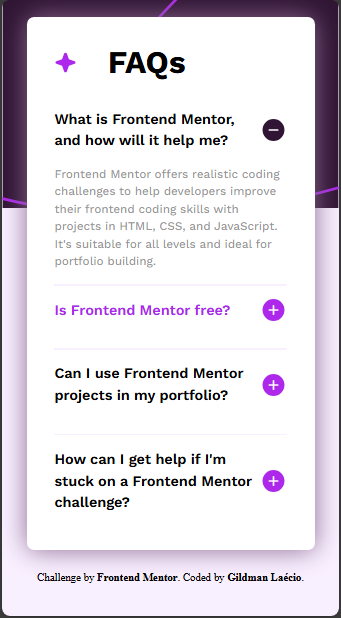

# faq-accordion-main
 A FAQ made with accordion effect

This is a solution to the [Faq-Accordion-main challenge on Frontend Mentor](https://www.frontendmentor.io/challenges/faq-accordion-wyfFdeBwBz). Frontend Mentor challenges help you improve your coding skills by building realistic projects. 

## Table of contents

- [Overview](#overview)
  - [Screenshot](#screenshot)
  - [Links](#links)
- [My process](#my-process)
  - [Built with](#built-with)
  - [What I learned](#what-i-learned)
  - [Continued development](#continued-development)
- [Author](#author)

## Overview

### Screenshot

These are my screenshots showing how the project turned out.

- For desktop version:









- For mobile version:





### Links

- Solution URL: [My Solution](https://gillaercio.github.io/faq-accordion-main/)

## My process

### Built with

- Semantic HTML5 markup
- CSS custom properties
- Grid Layout
- Mobile-first workflow
- JavaScript

### What I learned

I took advantage of this project to practice the use of **Grid Layout**:

Simple use of grid-template-columns

```css
.header-content {
  display: grid;
  grid-gap: 30px;
  width: 150px;
  grid-template-columns: repeat(2, auto);
  align-items: center;
}
```

Accordion effect with JavaScript

```javascript
document.addEventListener('DOMContentLoaded', function() {
  const faqQuestions = document.querySelectorAll('.question');
  const image = document.querySelectorAll('.icon');

  faqQuestions.forEach(question => {
    question.addEventListener('click', function() {
      const answer = this.nextElementSibling;
      const image = this.querySelector('.icon');
      if (answer.style.display === 'none' || answer.style.display === '') {
        answer.style.display = 'block';
        image.src = 'assets/images/icon-minus.svg';
      } else {
        answer.style.display = 'none';
        image.src = 'assets/images/icon-plus.svg';
      };
    });
  });
});
```

### Continued development

I would like to improve the use of **grid layout** in conjunction with media queries.

In addition to practicing the most commonly used effects in **JavaScript** for DOM alteration.

## Author

- Frontend Mentor - [@gillaercio](https://www.frontendmentor.io/profile/gillaercio)
- Github - [My Github](https://github.com/gillaercio)
- LinkedIn - [My LinkedIn](https://www.linkedin.com/in/gildman-la%C3%A9rcio/)